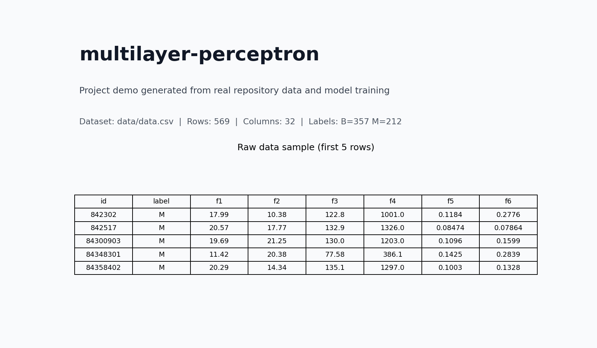

# Multilayer Perceptron (From Scratch)

A NumPy-based multilayer perceptron implementation with custom layers, activations, costs, and training methods (`GD`, `RMSProp`, `MO`), plus example workflows for:

- Breast-cancer classification from `data/data.csv`
- Handwritten digit classification in `nmist_example/`



## Repository Layout

- `layer.py`: core MLP implementation (layers, activations, costs, training loop)
- `preprocesing.py`: dataset split + normalization + one-hot encoding
- `training.py`: model training CLI and model export (`*.joblib`)
- `predict.py`: prediction/evaluation script
- `data/data.csv`: bundled breast-cancer dataset
- `nmist_example/`: MNIST-style example assets and scripts

## Requirements

Python 3.10+ recommended.

```bash
python3 -m venv .venv
. .venv/bin/activate
pip install numpy pandas scikit-learn joblib tqdm plotly matplotlib
```

## Quick Start (Breast-Cancer Data)

```bash
python3 preprocesing.py data/data.csv
python3 training.py -la 30 30 -e 250 -lo CrossEntropy -lr 0.001 -f data -a Relu -m MO -b 5 -l2 0.01 -s
```

Expected generated files include:

- `data_TD.csv`, `data_TT.csv`, `data_VD.csv`, `data_VT.csv`
- `data_preprocess.joblib`
- `data_model.joblib`

## MNIST Number Demo

```bash
cd nmist_example
python3 example.py
python3 visualizer.py
```

## Notes

- `training.py` requires at least two hidden layers (`-la` must include 2+ values).
- At the end of training, Plotly figures are shown.
  In headless environments (no browser/UI), this can fail unless plotting is disabled or renderer setup is adjusted.
- `predict.py` currently calls `training.create_network`, which is not defined in `training.py`.
  If you want, I can fix this script next so end-to-end CLI inference works from the root workflow.
